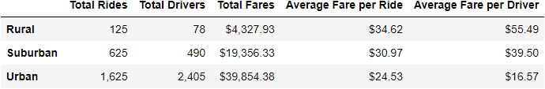
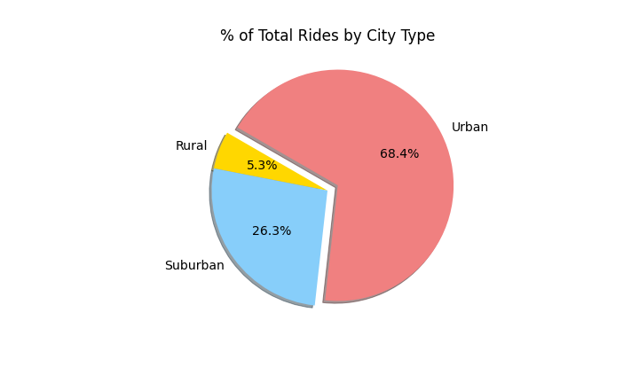
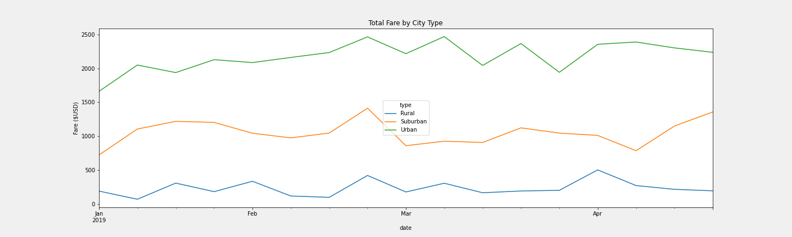

# Analysis of Pyber Ridesharing by City Type
## Overview
You asked for an analysis of Pyber ride-sharing data that focuses on the differences by city type. I will describe the difference among the different city types with respect to rides, drivers, fares, average far per ride, average fare per driver, and total weekly fares over time. See a summary data frame below:

## Results

Please see the summary data frame below. Brief discussion of each metric follow.

### Total Rides
Total rides are highest in urban areas (1,625 rides), with less than half as many rides in suburban (625) and rural areas (125).

### Total Drivers
Similarly, the majority of drivers are in urban areas (2,405 drivers), with less 25% as many drivers in suburban (490) and rural areas (78).

### Total Fares
Total fares are about twice as high in urban areas (approximately $40,000) than in suburban areas (approximately $20,000). Rural areas (approximately $4,000) take in about 20% of the fares that urban areas do. 

### Average Fare per Ride
Average fare per ride is highest in rural areas, then suburban and urban areas.

### Average Fare per Driver 
Average fare per driver is highest in rural areas, then suburban and urban areas.

### Weekly Fares by City Type
The summary chart below shows that stark difference in weekly fares for each city type, with only minor fluctuations over time.

As expected, in areas with lower population density, the number of rides and drivers are dramatically lower. The average far per ride and average fare per driver is disproportionately higher in response. Although most of the fares are coming from urban areas, inividual rides have the highest fare in rural areas.

### Summary

Based on the analysis above, I can make the following provisional reccomendations: 

1. **Subsidize the fares for riders in rural and suburban communities on a sliding scale** (higher subsidy for more remote areas). If alleviating disparities and improving transportation access is a goal of Pyber, the high cost of fares for riders is a significant barrier. Analysis would need to be done to ensure fares remain profitable, or to see how much of a loss is tolerable.

2. **Subsidize the fares for drivers in rural and suburban communities on a sliding scale** (higher subsidy for more remote areas). The next major barrier in rural and suburban areas is the lack of drivers. Drivers can be encouraged to work in less busy areas by increasing the share of the fare that they take home. Analysis would need to be done to ensure fares remain profitable, or to see how much of a loss is tolerable.

3. **Focus marketing and recruiting efforts in suburban areas.** Suburban areas appear to be unsaturated, with fares that are disproportionately high compared to the demand. Marketing to attract riders and recruitment to attract drivers would likely be effective, even without subsidies. 
 
